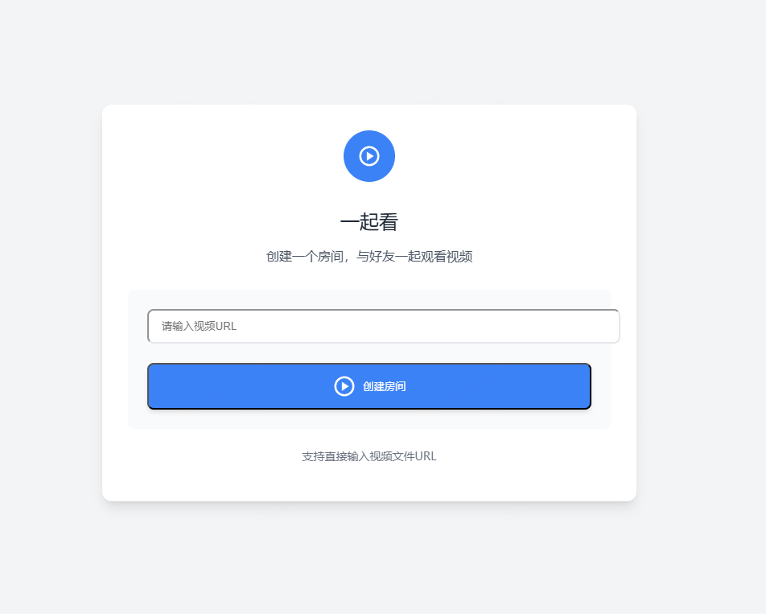
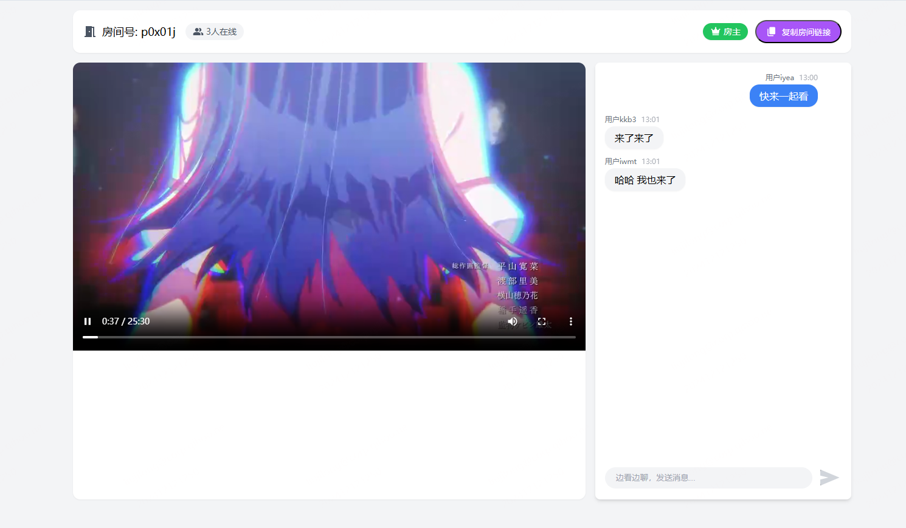
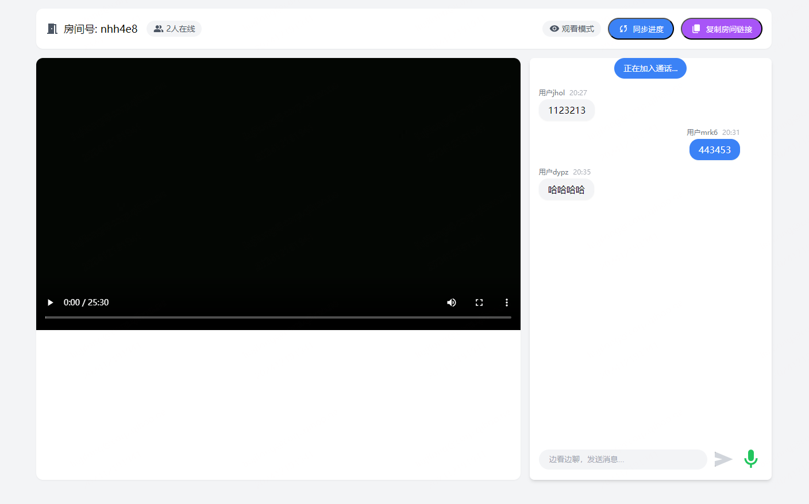
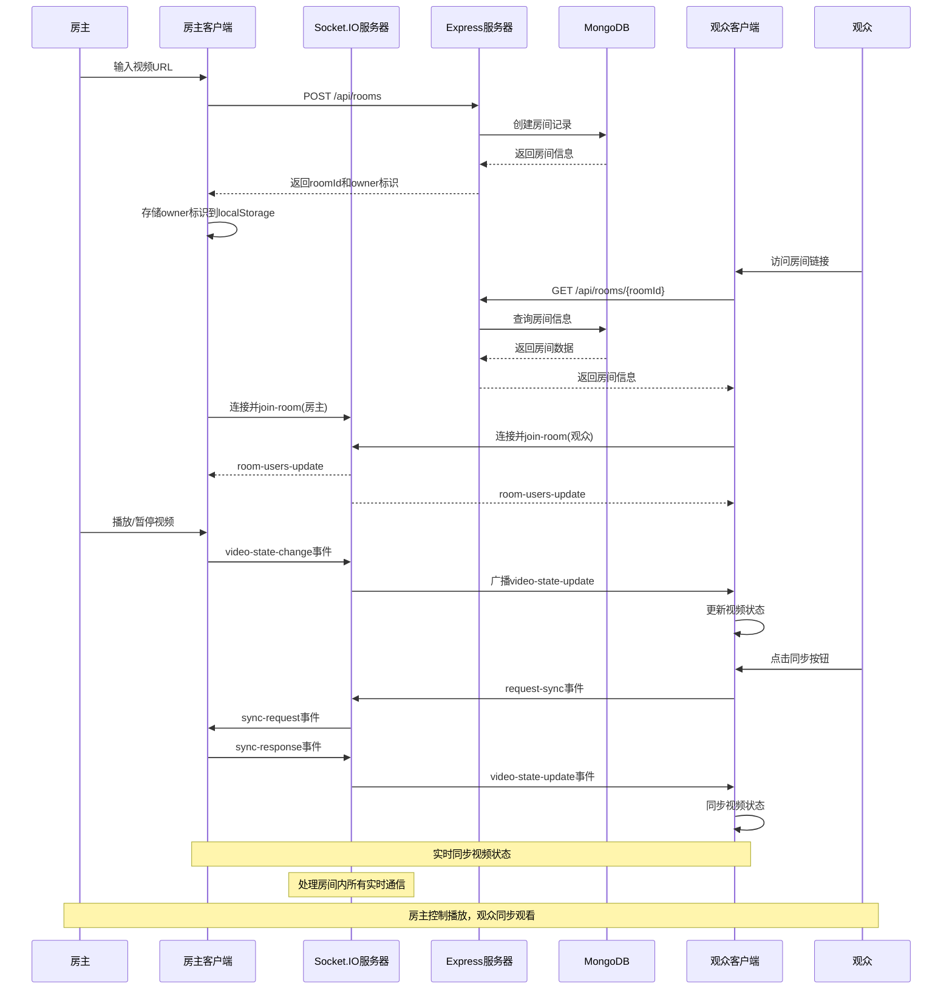
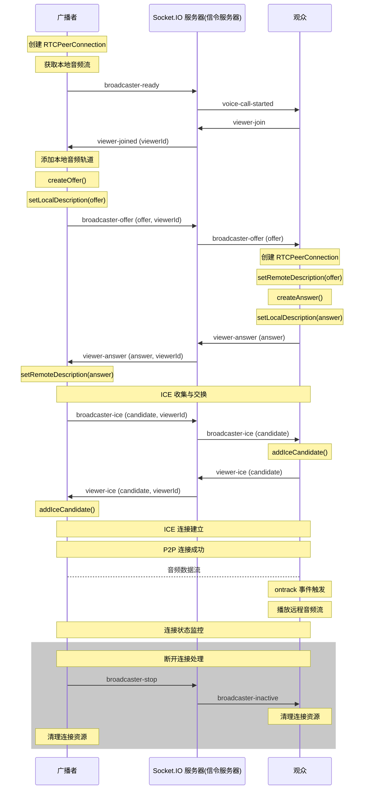

# 一起看

一个基于 Web 的实时视频同步观看应用(MVP)。让你可以和好友一起在线观看视频，支持同步播放、暂停和进度控制。支持聊天室和语音通话功能。

### 创建房间


### 房主视角


### 观众视角



## 功能

- 🎥 创建观影房间
- 👥 多人实时同步观看
- 🎮 房主播放控制
- 🔄 观众进度同步
- 📋 一键复制房间链接分享
- 💬 实时聊天室
- 🎙️ 语音通话(实验性功能)

## 技术栈

- 前端: Vue 3 + Vite + UnoCSS
- 后端: Express + Socket.IO
- 数据库: MongoDB
- 语音通话: WebRTC

## 快速开始

### 克隆项目
```bash
git clone https://github.com/liujilongObject/watch-together.git
```

### 安装依赖
```bash
npm install
```

### 配置环境变量
```bash
MONGODB_URI=your_mongodb_uri # 数据库连接地址
```

### 快速启动服务

```bash
npm run start
```

### 访问应用
`http://localhost:7766`


## 使用方法

1. 在首页输入视频 URL 创建房间
2. 复制房间链接分享给好友
3. 房主可以控制视频播放/暂停
4. 观众可以点击同步按钮与房主进度保持一致
5. 进入房间，授权麦克风权限，即可开始语音通话


## 项目结构
```
├── client/ # 前端代码
│ ├── src/
│ │ ├── views/ # 页面组件
│ │ ├── components/ # 通用组件
│ │ └── utils/ # 工具函数
│ └── vite.config.js # Vite 配置
│
└── server/ # 后端代码
│ ├── index.js # 服务器入口
│ └── models/ # 数据模型
```


## 注意事项

- 仅支持可直接访问的视频文件 URL
- 建议使用现代浏览器访问
- 目前仅用于本地开发验证
- 未加入用户系统，房主身份默认存储在 `localStorage`，使用不同浏览器区分用户身份 (即使用不同的浏览器访问房间链接，模拟多设备同时观看视频。`PS: 也可以使用 sessionStorage 区分用户身份（修改环境变量 USER_IDENTITY 为 sessionStorage），在同一浏览器中打开不同标签页访问房间链接即可。`)
- 注意更新数据库连接地址 (本地 MongoDB 连接地址 或 远程 MongoDB 连接地址)
- 语音通话功能为实验性功能，建议在 chrome 浏览器中使用 （请求麦克风权限需在 localhost 域名 或 https 域名下）


## 时序图

### 创建房间&视频状态同步



### WebRTC 语音通话流程



## 许可证

MIT
